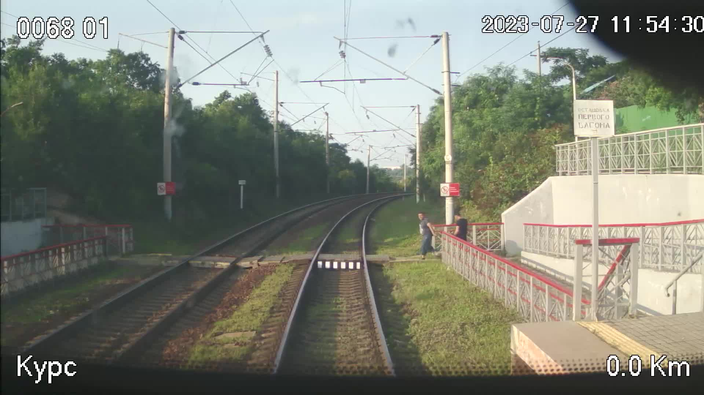
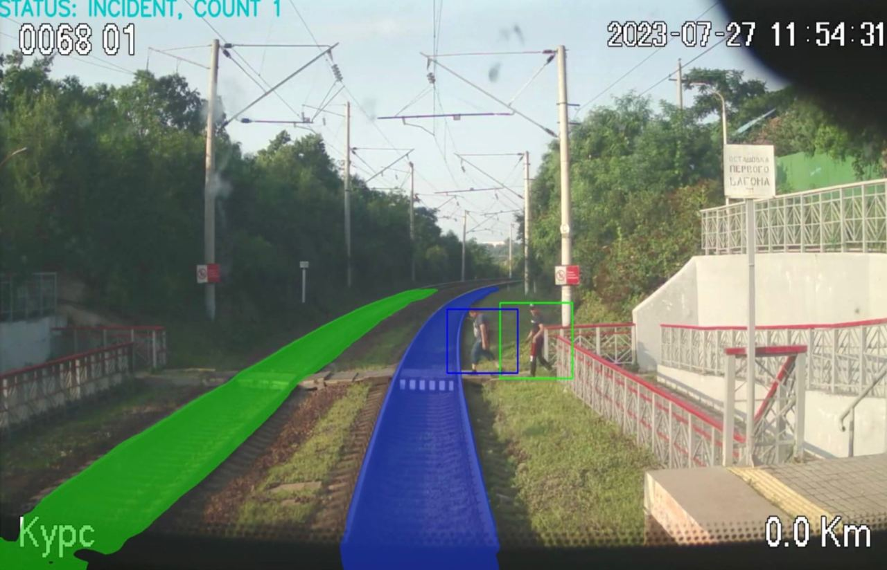
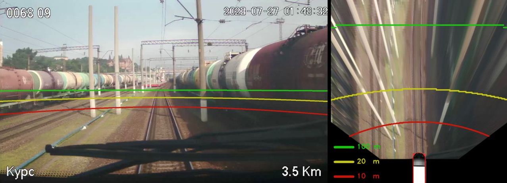

# <p align="center">Цифрвовой прорыв: сезон ИИ</p>
## <p align="center">Безопасный маршрут</p>


## Содержание
- [Содержание](#содержание)
- [Задание](#задание)
- [Решение](#решение)
  - [Уникальность](#уникальность)
  - [Примеры работы](#примеры-работы)
  - [Стэк](#стэк)
  - [Структура директорий](#структура-директорий)
- [Установка и запуск](#установка-и-запуск)
- [Обучение моделей](#обучение-моделей)


## Задание
При движении моторвагонного подвижного состава имеют место случаи выхода на маршрут следования людей, попадания посторонних предметов на железнодорожные пути или выезд автотранспорта. В таких ситуациях без преувеличения важна каждая секунда, и, если локомотивная бригада не принимает оперативных мер по причине отвлечения от контроля маршрута следования, может произойти трагедия. Аналогичные требования относятся и ко времени реагирования на случаи следования на «красный» сигнал светофора. Своевременное реагирование в данных ситуациях - это спасённые жизни и предотвращение случаев нарушения безопасности движения.
Участникам хакатона предстоит создать систему контроля за состоянием пути, показанием светофоров (готовность маршрута), наличия посторонних лиц, предметов на железнодорожном полотне, препятствующих свободному следованию подвижного состава, приближающихся транспортных средств. Система должна анализировать видеопоток постоянно и при выявлении людей или посторонних предметов, запрещающего «красного» сигнала светофора иметь возможность послать сигнал на устройство световой и звуковой индикации.

## Решение
### Уникальность
- Ансамбль моделей глубокого обучения и классических алгоритмов
- Квантизация моделей сегментации и детекции для ускорения инференса
- Оптимизация моделей под TensroRT
- Нахождения дистанции между объектами в метрах
- Веб интерфейс

### Примеры работы
1. Сегментация основного и побочного путей маршрута. Детекция пешеходов.


2. Слева - вычисление линии на расстояниях 10, 20 и 100 метров от камеры. Справа - вид сверху на маршрут поезда.
Посмотрите [видеоверсию!](https://drive.google.com/file/d/1_9dY4oTE-lisvIhNVidGyK169r54kulL/view?usp=sharing)


### Стэк
    - PyTorch
    - OpenCV
    - TensorRT
    - SuperGradients
    - Streamlit

### Структура директорий
- [models_inference](https://github.com/AlexeySrus/railway_analysis/tree/main/models_inference) <br>
Содержит классы и функции для запуска моделей.

- [research](https://github.com/AlexeySrus/railway_analysis/tree/main/research) <br>
Jupyter notebooks с различными экспериментами, которые мы проводили. В частности - это оценка расстояния, различные подходы к детекции и сегментации.

- [utils](https://github.com/AlexeySrus/railway_analysis/tree/main/utils) <br>
Полезные функции для работы с изображениями и для предобработки/постобработки данных.

- [frontend](https://github.com/AlexeySrus/railway_analysis/tree/main/frontend) <br>
Веб-интерфейс приложения на Streamlit.

## Установка и запуск
Самый простой способ запуска - использовать Docker.

1. Предварительно скачайте папку с весами обученных моделей по [ссылке](https://disk.yandex.ru/d/LhyLduv2Jqu0eQ/weights).
2. Мы предоставляем 2 версии решения: `CPU` и `GPU`. Для сборки и запуска `CPU` версии выполните команду
```bash
$ docker-compose --profile cpu up --build
```
или `GPU` версии
```bash
$ docker-compose --profile gpu up --build
```
1. Перейдите по адресу http://127.0.0.1:8052, что бы получить доступ к веб-интерфейсу и начать анализ видео.

## Обучение моделей

В нашем решении мы обучали модель выделения Ж/Д путей. В качестве данных мы использовали датасет с сегментацией трех классов:
`основные пути`, `второстепенные пути`, `вагоны поезда`.
Данный набор данных можно скачать по следующей [ссылке](andexDisk "Yandex Disk"). 

Для обучения сегментационной модели мы использовали фреймворк `super-gradients`, установить его вы можете с помощью следующей команды:
```bash
pip3 install super-gradients
```

Jupyter дорожка с кодом обучения имеет следующее расположение:
`research/notebooks/railway_segmentation_super_gradients.ipynb`

Для воспроизведения экспериментов в ней следует поменять путь до набора данных и путь до директории с экспериментами.
